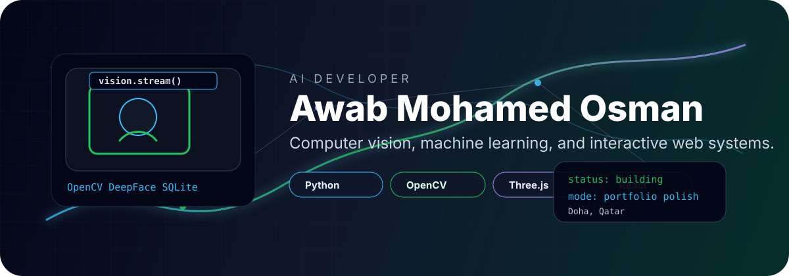

<p align="center">
  
</p>

<p align="center">
  <a href="https://github.com/awabmoha">
    
  </a>
</p>

<p align="center">
  <a href="https://awab-ai.vercel.app">
    
  </a>
  <a href="mailto:oawab06@gmail.com">
    
  </a>
  <a href="https://github.com/awabmoha">
    
  </a>
</p>

<p align="center">
  
  
  
</p>

<p align="center">
  
</p>

## System Identity

```txt
operator      Awab Mohamed Osman
base          Doha, Qatar
track         Artificial Intelligence student
specialty     computer vision, applied ML, generative AI, interactive web systems
current goal  make every project feel real, useful, and clean enough to publish
```

I build across the whole stack of an AI project: messy idea, model behavior, backend logic, data handling, interface design, documentation, and the final GitHub polish that makes someone want to click around.

<table>
  <tr>
    <td width="33%">
      <h3 align="center">Vision Lab</h3>
      <p align="center">OpenCV pipelines, face analytics, camera workflows, model behavior testing, and safer local data storage.</p>
    </td>
    <td width="33%">
      <h3 align="center">AI Systems</h3>
      <p align="center">ML workflows, notebooks, response evaluation, feedback loops, and practical model experiments.</p>
    </td>
    <td width="33%">
      <h3 align="center">Web Experience</h3>
      <p align="center">React, Vite, Three.js, animated interfaces, portfolio systems, and product-style UI presentation.</p>
    </td>
  </tr>
</table>

## Featured Work

<table>
  <tr>
    <td width="50%">
      <a href="https://github.com/awabmoha/mlAgeGenderemotions">
        
      </a>
      <h3>Real-Time Face Analytics</h3>
      <p>Local webcam analytics with OpenCV, optional DeepFace emotion/identity analysis, SQLite embeddings, safer opt-in face registration, setup checks, and clean GitHub documentation.</p>
      <p>
        
        
        
        
      </p>
    </td>
    <td width="50%">
      <a href="https://awab-ai.vercel.app">
        
      </a>
      <h3>3D AI Portfolio</h3>
      <p>An interactive portfolio experience built with React, Vite, Three.js, React Three Fiber, Drei, and GSAP. It turns a CV into something people can explore instead of just read.</p>
      <p>
        
        
        
        
      </p>
    </td>
  </tr>
</table>

## Project Console

| Area | What I am building toward |
| --- | --- |
| Computer Vision | Face analytics, webcam apps, OpenCV model pipelines, privacy-aware local recognition |
| Machine Learning | Reusable training/evaluation workflows, notebooks, preprocessing, model comparison |
| Generative AI | Prompt workflows, response ranking, human feedback loops, multimodal experiments |
| Frontend | Portfolio experiences, dashboards, 3D UI, polished project presentation |
| Backend | Python services, local data storage, setup scripts, clear developer documentation |

## Stack Arsenal

<p align="center">
  
</p>

<p align="center">
  
  
  
  
</p>

## Learning Signal

<table>
  <tr>
    <td><strong>University</strong></td>
    <td>Artificial Intelligence student at Lusail University</td>
  </tr>
  <tr>
    <td><strong>AI Training</strong></td>
    <td>Huawei HCIA-AI, Intel / Google / Cisco AI learning paths</td>
  </tr>
  <tr>
    <td><strong>Systems</strong></td>
    <td>Cisco networking foundations, local development, GitHub publishing, project documentation</td>
  </tr>
</table>

## GitHub Telemetry

<p align="center">
  
  
</p>

<p align="center">
  
</p>

<p align="center">
  
</p>

<p align="center">
  
</p>

<p align="center">
  <strong>Building AI projects that look good, run locally, explain themselves, and are worth opening twice.</strong>
</p>
