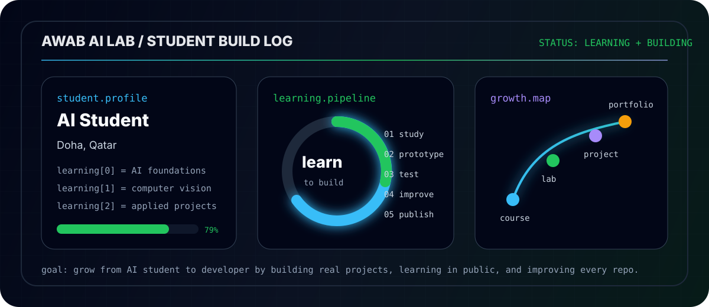
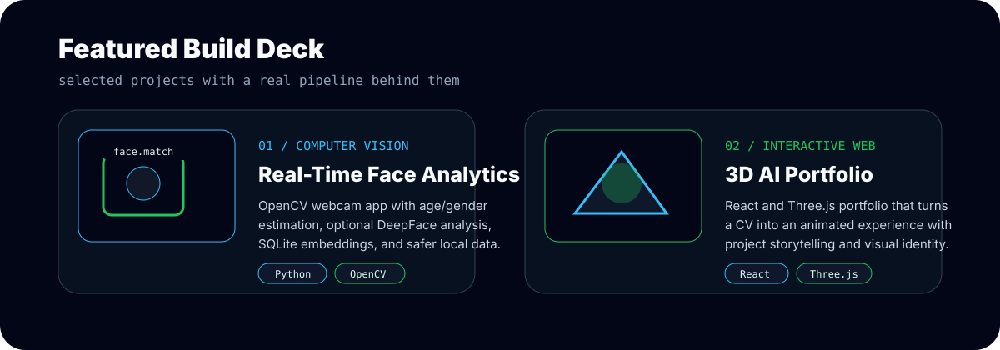
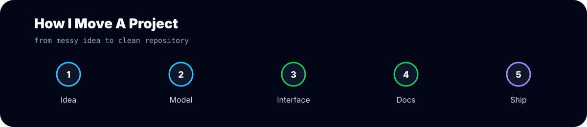

  

  

  
  
  

  
  
  

  

## Operator Brief

I build across the full path of an AI project: idea, model behavior, backend logic, data handling, interface design, documentation, and the GitHub polish that makes someone want to click around.

I am not trying to make projects that only look good in a screenshot. I want them to run locally, explain themselves clearly, and feel like something a real person could use, test, or expand.

  

<table>
  <tr>
    <td width="50%">
      <h3>Real-Time Face Analytics</h3>
      
Local webcam analytics with OpenCV, optional DeepFace emotion/identity analysis, SQLite embeddings, safer opt-in face registration, setup checks, and clean GitHub documentation.

      
<a href="https://github.com/awabmoha/mlAgeGenderemotions"><strong>Open Repository</strong></a>

    </td>
    <td width="50%">
      <h3>3D AI Portfolio</h3>
      
React and Three.js portfolio that turns a CV into an animated experience with project storytelling, visual identity, and a stronger first impression.

      
<a href="https://awab-ai.vercel.app"><strong>Open Live Portfolio</strong></a>

    </td>
  </tr>
</table>

  

  

## Build Matrix

| Layer | Tools | What I use it for |
| --- | --- | --- |
| Vision | OpenCV, DeepFace, NumPy | webcam analysis, face detection, embeddings, model behavior checks |
| AI / ML | Python, Pandas, scikit-learn | preprocessing, evaluation, notebooks, feedback loops |
| Web | React, Vite, Three.js, GSAP | interactive portfolios, dashboards, animated project interfaces |
| Backend | Flask, SQLite, local scripts | APIs, local storage, setup checks, reproducible runs |
| Publishing | Git, GitHub, Markdown, Vercel | clean repos, project READMEs, deployment, profile presentation |

## Stack Arsenal

  

  
  
  
  
  

## Learning Signal

<table>
  <tr>
    <td><strong>University</strong></td>
    <td>Artificial Intelligence student at Lusail University</td>
  </tr>
  <tr>
    <td><strong>AI Training</strong></td>
    <td>Huawei HCIA-AI, Intel / Google / Cisco AI learning paths</td>
  </tr>
  <tr>
    <td><strong>Systems</strong></td>
    <td>Cisco networking foundations, local development, GitHub publishing, project documentation</td>
  </tr>
</table>

  

## GitHub Telemetry

  
  

  

  

  

  <strong>Building AI projects that look sharp, run locally, explain themselves, and are worth opening twice.</strong>

